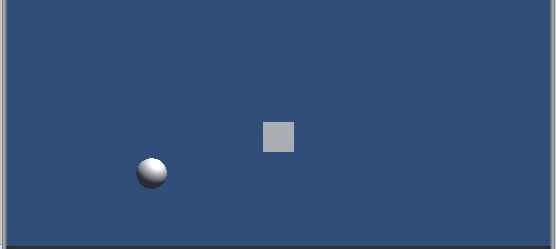

# Unity Water2D

Crear agua para juego 2D, basado en el tutorial de:
https://gamedevelopment.tutsplus.com/es/tutorials/creating-dynamic-2d-water-effects-in-unity--gamedev-14143

Pero optimizado con menos vertices y UV para texturas más complejas.

  

Agua protipo para agua SanchoVilla.

El proyecto es librer de utilizar y modificar sin ningun problema, es una base.
